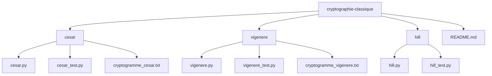

# Projet : Cryptographie Classique

## Introduction 

Projet regroupant des scripts Python d'exemples de chiffrements classiques (César, Vigenère, Hill). Chaque module fonctionne indépendamment 
et illustre les bases de la cryptographie par substitution ou par transformation matricielle.

## Structure 

## Fonctionnalités principales

- César : Décalage simple sur chaque lettre du message 
- Vigenère : Décalage selon une clé répétée, substitution polyalphabétique 
- Hill : Chiffrement par blocs via multiplication matricielle mod 26

 

Auteur : Anas EL Faijah  
Contacte moi : Via https://www.linkedin.com/in/anaselfaijah/  or elfaijahanas@gmail.com  